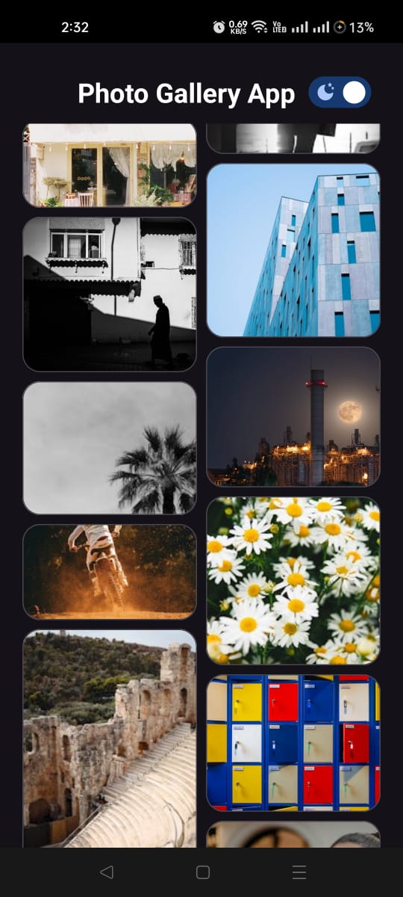
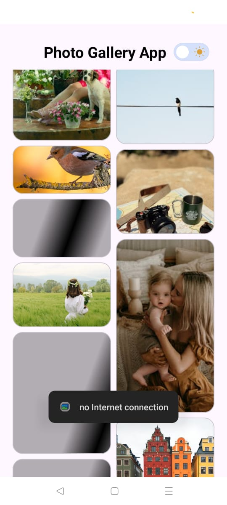
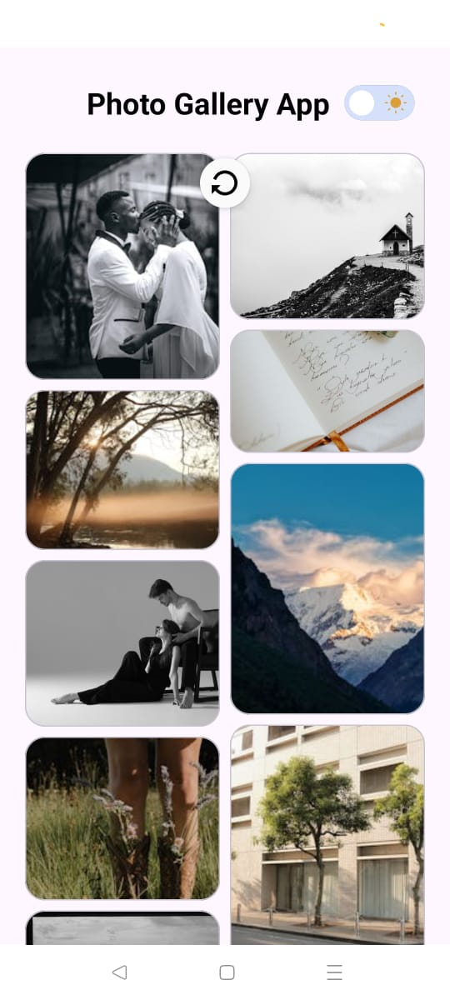

# 📸 Photo Gallery App

A simple Android application to display a list of curated photos using the [Pexels API](https://www.pexels.com/api/).  
Built with Kotlin, MVVM, Retrofit, Glide, and Paging.

---

## 🚀 Features

- Fetches and displays curated photos from Pexels API.
- Supports pagination (infinite scroll).
- Shimmer loading effect while images load.
- Light/Dark mode switch with animation.
- Swipe to refresh.
- Error handling with fallback message.
- online and offline.

---

## 📱 Screenshots


# 🚀 Splash


# 🌙 Home Dark



# ☀ Home Light


# ✨ Home Shimmer



# 🔄 Refresh




---

## 🎬 Demo Video (https://drive.google.com/file/d/1MWUOdTleOETBTBPgAqStNSGpr3R_vJ8-/view?usp=drivesdk)

---

## 🛠️ Tech Stack

- Kotlin
- MVVM Architecture
- Retrofit
- Room DB
- Glide
- Paging (Manual)
- Material Components
- Shimmer Layout
- Hilt (Dependency Injection)

---

## 🧪 API Used

[Pexels API – Curated Photos](https://www.pexels.com/api/documentation/)

```http
GET https://api.pexels.com/v1/curated?page=1&per_page=20
