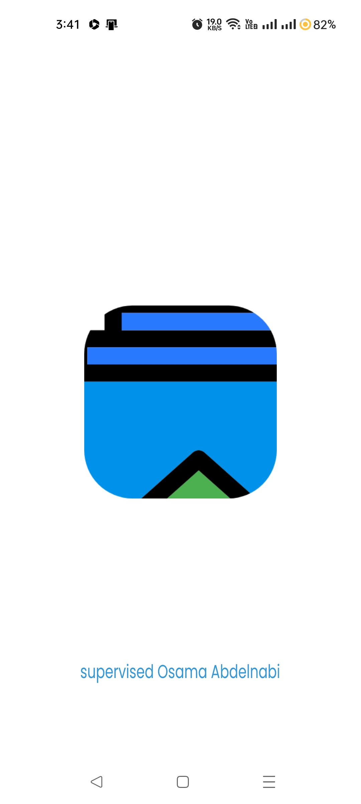
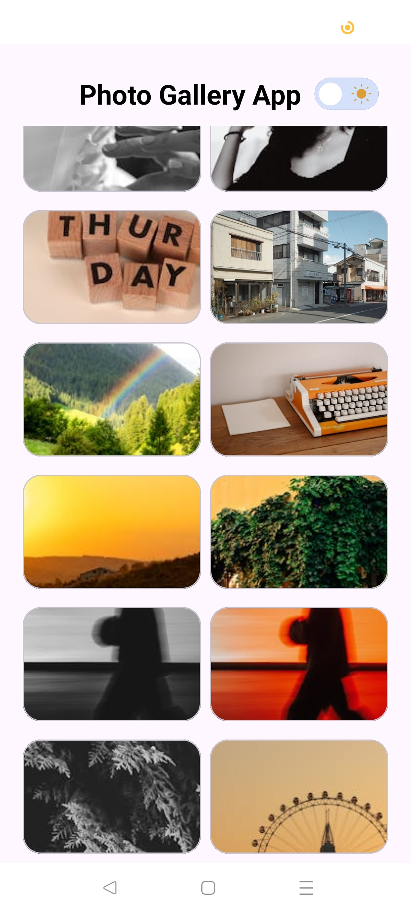
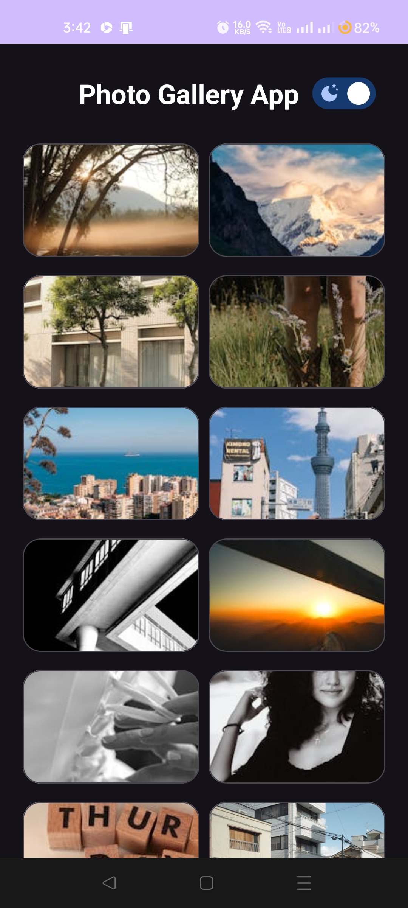
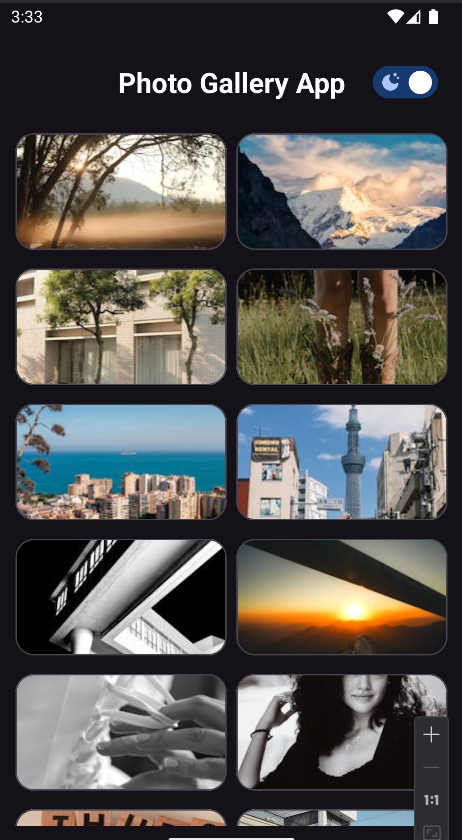

# 📸 Photo Gallery App

A simple Android application to display a list of curated photos using the [Pexels API](https://www.pexels.com/api/).  
Built with Kotlin, MVVM, Retrofit, Glide, and Paging.

---

## 🚀 Features

- Fetches and displays curated photos from Pexels API.
- Supports pagination (infinite scroll).
- Shimmer loading effect while images load.
- Light/Dark mode switch with animation.
- Swipe to refresh.
- Error handling with fallback message.

---

## 📱 Screenshots

### 🔹 Home Screen


### 🔹 Loading with Shimmer


### 🔹 Dark Mode


### 🔹 Grid View


### 🔹 App Home Dark


---

## 🎬 Demo Video (https://drive.google.com/file/d/1MSM-lQ3GioY3woNjWdi0NRX-bGYYwZu_/view?usp=drivesdk)

---

## 🛠️ Tech Stack

- Kotlin
- MVVM Architecture
- Retrofit 
- Glide
- Paging (Manual)
- Material Components
- Shimmer Layout
- Hilt (Dependency Injection)

---

## 🧪 API Used

[Pexels API – Curated Photos](https://www.pexels.com/api/documentation/)

```http
GET https://api.pexels.com/v1/curated?page=1&per_page=20
